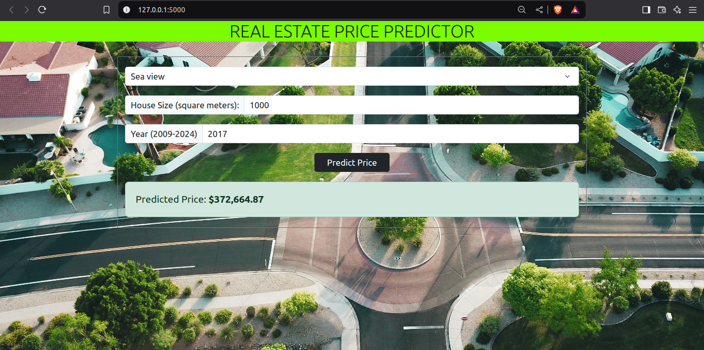

# 🏠 Real Estate Price Predictor

A little Flask web app that takes house details — `size`, `year`, and `view` — and uses a support vector regressor model to predict its price.

Now on render: https://real-estate-price-predictor-2uw1.onrender.com/

## 💡 Features

- Predicts housing prices using a pre-trained `.pkl` model
- Clean UI with Bootstrap 5
- Interactive form submission with vanilla JavaScript
- Minimal dependencies, fast and lightweight

## ⚽️ Tech Stack

- Python 3.11
- Flask
- Scikit-learn (for SVR model)
- HTML/CSS/Bootstrap
- JavaScript (basic fetch API)
- [Pickle](https://docs.python.org/3/library/pickle.html) for model serialization
- Gunicorn (for production serving)
- uv (dependency + environment manager)

## 🏎️ Run it own your own machine

1. Clone the repo:

   `git clone https://github.com/TDJR007/real-estate-price-predictor.git`

   `cd real-estate-price-predictor/`

2. Set up the virtual environment (using [uv](https://docs.astral.sh/uv/)):

    `uv venv`

    `source .venv/bin/activate  # Linux/macOS`
    
    `.venv\Scripts\activate     # Windows`
    
3. Install dependencies:

    `uv sync`
    
4. Run SVR_Real_Estate.py to generate pickle files:

    `cd model && uv run SVR_Real_Estate.py`
    
    or you could use the notebook in model/

4. Run the app:
   
    `cd .. && uv run gunicorn app:app --workers=4 --threads=2 --timeout=120 app.py`

6. Open your browser at ` http://127.0.0.1:8000`

## 📸 Credits

Special thanks to *Avi Waxman*! 😊️ for giving away his beautiful picture "white-and-red houses" royalty free on unsplash. It serves as the background image for this project and we appreciate the vibes.
